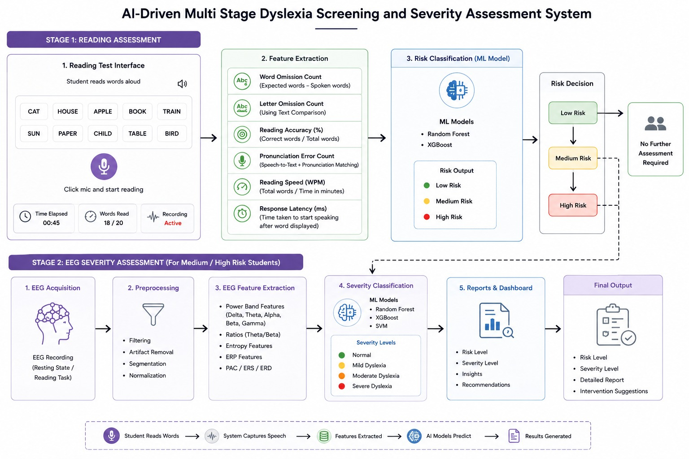

## AI-Driven Multi Stage Dyslexia Screening and Severity Assessment System

## Overview

Dyslexia is one of the most common learning disorders affecting reading, spelling, writing, and language processing abilities. Existing dyslexia detection systems often rely on expensive EEG, MRI, fMRI, VR, and eye-tracking technologies, making large-scale screening difficult. Moreover, most existing solutions provide only binary predictions (Dyslexic / Non-Dyslexic) without assessing severity.

This project proposes a cost-effective, AI-driven multi-stage screening framework that combines reading assessment and EEG analysis to identify dyslexia risk and estimate severity levels for early intervention.

---

## Problem Statement

* Dyslexia affects approximately **5–10% of the global population** and up to **20% of school-age children**.
* Nearly **80–90% of all learning disabilities** are associated with dyslexia.
* Traditional psychometric assessments are time-consuming and require trained specialists.
* Advanced diagnostic techniques such as EEG, MRI, fMRI, and eye-tracking are expensive and inaccessible for large-scale school screening.
* Most existing AI systems provide only binary classification and do not estimate severity.
* Reading behavior indicators such as pronunciation errors, reading speed, omissions, and response latency are often overlooked.

---

## Proposed Solution

An AI-driven multi-stage dyslexia screening system that:

1. Screens students using reading assessment and speech analysis.
2. Identifies Low, Medium, and High-risk students.
3. Refers only Medium and High-risk students for EEG analysis.
4. Predicts dyslexia severity levels:

   * Normal
   * Mild Dyslexia
   * Moderate Dyslexia
   * Severe Dyslexia

---
## System Workflow

  

---

## Stage 1: Reading Assessment

### Inputs

* Letters
* Words
* Sentences
* Paragraphs

### Features Extracted

* Word Omission Count
* Letter Omission Count
* Reading Accuracy (%)
* Pronunciation Error Count
* Reading Speed (WPM)
* Response Latency

### Output

* Low Risk
* Medium Risk
* High Risk

---

## Stage 2: EEG Severity Assessment

### EEG Features

* Delta Power
* Theta Power
* Alpha Power
* Beta Power
* Gamma Power
* Theta/Beta Ratio
* Entropy Features
* ERP Features
* PAC / ERS / ERD Features

### Output

* Normal
* Mild Dyslexia
* Moderate Dyslexia
* Severe Dyslexia

---

## Technologies Used

### Frontend

* Next.js
* React.js
* Tailwind CSS

### Backend

* Node.js
* Express.js
* Python

### Database

* MongoDB

### Speech Processing

* OpenAI Whisper
* Web Speech API
* RapidFuzz

### EEG Processing

* MNE-Python
* NumPy
* SciPy

### Machine Learning

* Scikit-Learn
* XGBoost
* Random Forest
* Support Vector Machine (SVM)

---

## Algorithms Used

### Stage 1

* Random Forest
* XGBoost

### Stage 2

* Random Forest
* XGBoost
* SVM

### Final Decision Layer

* Weighted Voting Ensemble
* Severity Score Computation

---

## Datasets

### Reading Assessment

* Predicting Risk of Dyslexia Dataset (Kaggle)
* Oral Language Performance Dataset (Kaggle)
* English Pronunciation Error Detection Dataset (Kaggle)

### EEG Analysis

* OpenNeuro EEG Datasets
* Public Dyslexia EEG Datasets
* Learning Disorder EEG Datasets

---

## Expected Outcomes

* Early dyslexia screening in school environments
* Reduced dependency on expensive diagnostic procedures
* Severity-based dyslexia assessment
* Scalable and cost-effective screening framework
* Faster referral for specialized intervention

---

## Expected Accuracy

| Stage                                  | Expected Accuracy |
| -------------------------------------- | ----------------- |
| Reading Assessment Risk Classification | 85–92%            |
| EEG Severity Classification            | 88–95%            |
| Ensemble-Based Final Prediction        | 92–96%            |

*Accuracy values are estimated based on results reported in existing dyslexia screening, EEG classification, and ensemble learning research.*

---

## Future Enhancements

* Personalized intervention recommendations
* Multilingual reading assessment
* Explainable AI dashboards for educators and clinicians

---

## Project Goal

To develop a scalable, affordable, and accurate AI-powered dyslexia screening framework that enables early identification and severity assessment of dyslexia, supporting timely educational and clinical intervention.
